## PyInstallerGUI

一个将PyInstaller命令GUI化的小工具。让python项目的打包更加直观、方便且快捷。

基于： pyinstaller、pyside2、QBinder等。

---
### 说明

PyInstaller仅仅是将PyInstaller命令的众多参数通过GUI化的形式向用户呈现、接受用户的输入。
然后将用户的输入转换为命令行，最后调用PyInstaller命令进行真正的打包。本质上，它所替代的仅仅
是你手写命令行的过程，其他地方毫无区别。 所以，一定要**保证你所工作的环境正确地安装了PyInstaller**。

与PyInstaller使用spec文件作为配置文件不同，PyInstaller将所有的参数配置保持到一个JSON文件中，
该配置文件默认的名称是package.json。
你可以在通过文件（File）菜单下的命令来**新建一个配置**、**保存当前配置**或者是
**载入一个已有的配置**继续进行工作。下面是PyInstallerGUI"打包"自身所使用的配置文件：
```json
{
    "name": "PyInstallerGUI",
    "author": "zimolab@aliyun.com",
    "version": "0.0.1",
    "description": "一个简化PyInstaller命令行使用的小工具。界面基于PySide2构建。\n源码：https://github.com/zimolab/PyInstallerGUI.git\n开源协议：GPL v3.0",
    "pyinstaller": "pyinstaller",
    "pyimakespec": "pyi-makespec",
    "scripts": [
        "main.py"
    ],
    "options": {
        "addData": [
            "../data;data"
        ],
        "clean": true,
        "distPath": "./build/dist",
        "icon": "../data/logos/pyinstaller-gui.ico",
        "noConfirm": true,
        "productMode": "onedir",
        "productName": "PyInstallerGUI",
        "specPath": "./build",
        "windowMode": "windowed",
        "workPath": "./build",
        "upx": {},
        "hooks": {},
        "windows": {},
        "macOSX": {}
    }
}
```

PyInstaller命令每个参数其名称及描述都被设置为对应控件的工具提示（tooltip），将鼠标移到对应控件上
稍作停留，这些提示就会显示出来（如下图所示），这样可以很容易地弄清楚界面上每一个输入控件所对应的命令行参数名称、
含义、用法及其取值。

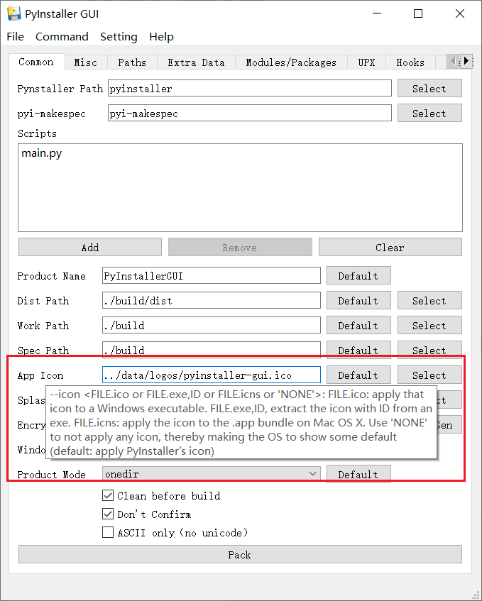

PyInstaller命令的参数众多，除了PyInstaller本身的参数也包括其他一些可以配置的选项，例如项目所使用的pyinstaller路径、
、当前的工作路径等，PyInstallerGUI按照这些参数的作用、性质、常用程度等方面，将其组织在不同的选项页下：

**1. Common页下： 最常用的一些参数，包括**

- 待打包的脚本列表
- 生成的可执行文件的名称
- 生成目录
- 应用图标路径
- splash图片路径
- 字节码加密密钥
- 是否显示控制台窗口
- 生成文件形式（单文件或文件夹）
- 打包前是否进行清理
- 替换旧文件前是不进行确认（建议总是打开这个选项）
- 是否只包含ascii字符集等等

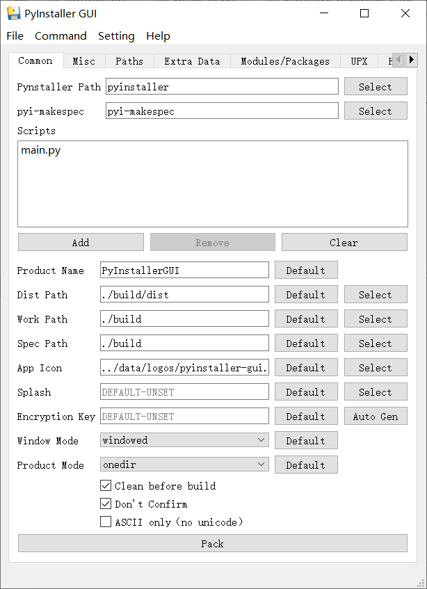


**2. Misc页：一些不太常用的杂项**
    
   - 当前工作路径（cwd）
   - 运行时临时目录
   - 日志级别等等

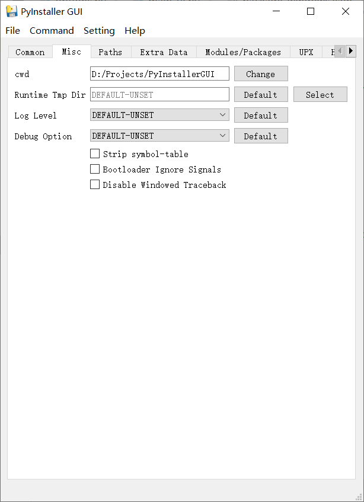

**3.Paths页：PyInstaller的搜索路径**

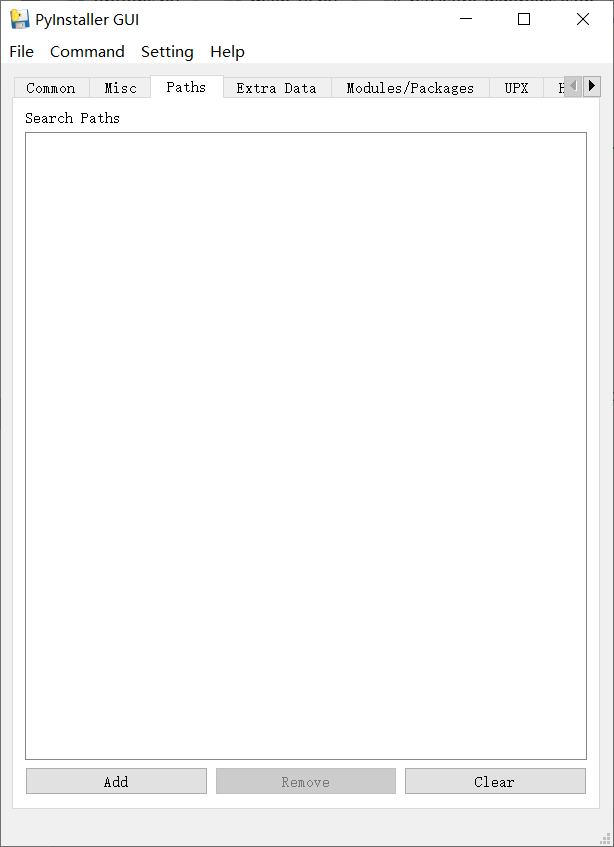

**4.Extra Data页：需要额外进行打包的非二进制文件、目录及二进制文件（如动态链接库等）**

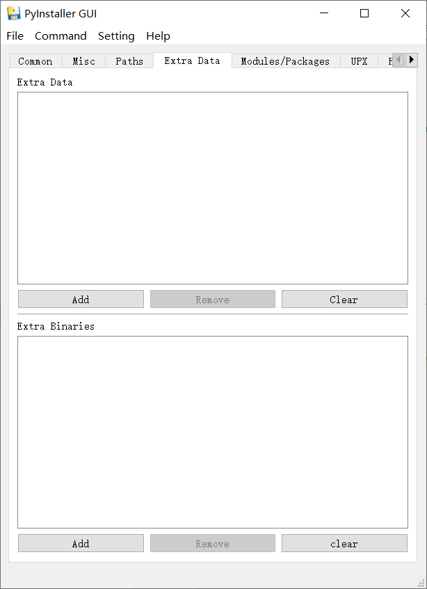

**5.Modules/Packages页：与模块以及包相关的选项**

- 隐式导入
- 需要排除的模块
- 需要从包中收集的内容等等

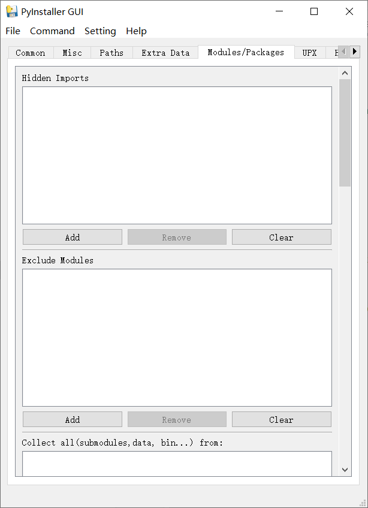


**6.UPX页：UPX相关的选项**

- 禁止使用UPX
- UPX所在路径
- 排除使用UPX的文件名称等

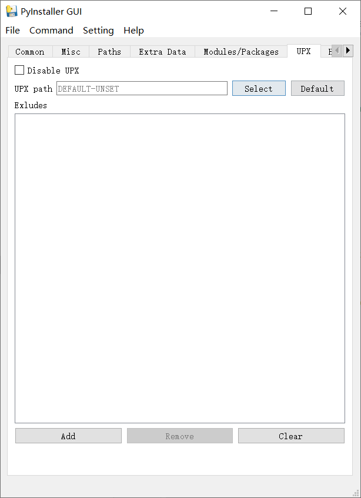

**7.Hooks页：hook相关的选项**

- hooks脚本的搜索路径
- 运行时hooks脚本路径

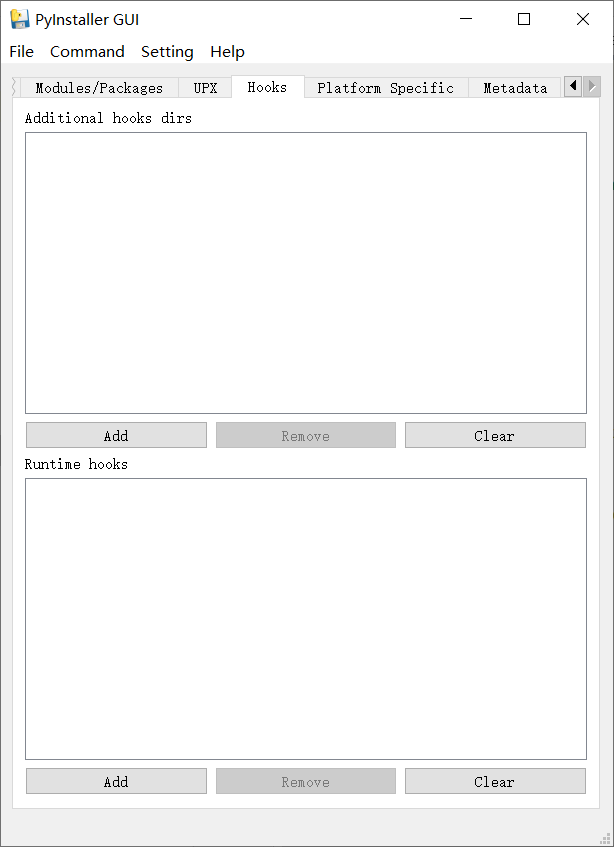

**8.Platform Specific页：平台（操作系统）相关的选项**

- windows操作系统专有的选项
- macOSX操作系统专有的选项

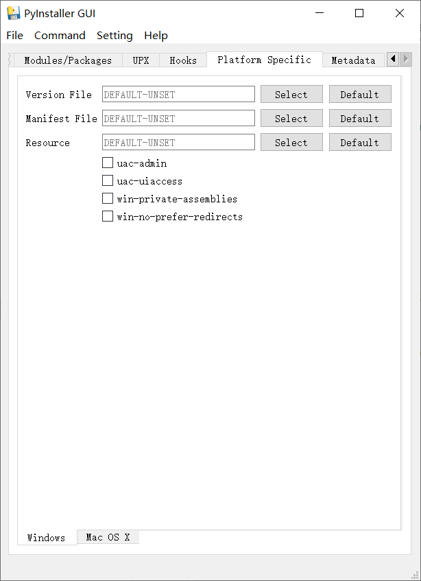
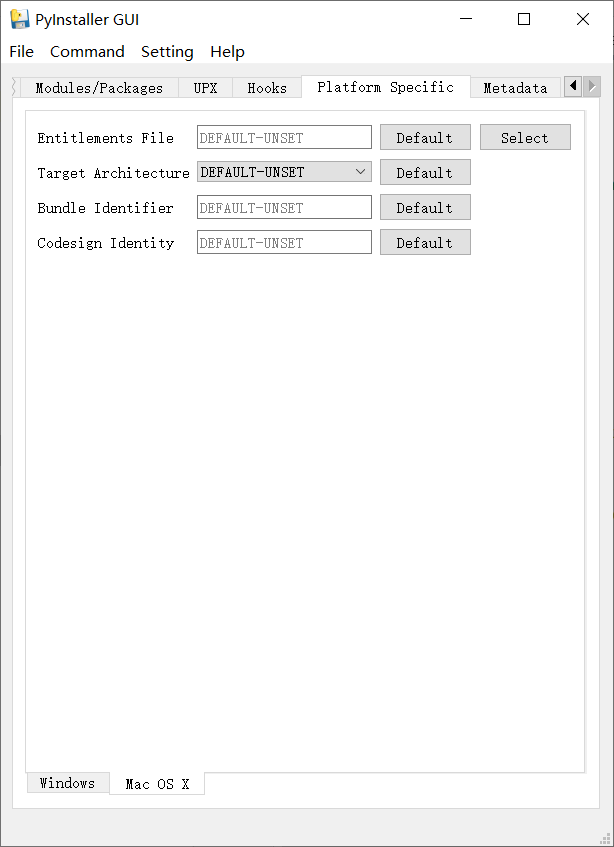

**9.Metadata页：用来描述项目的元信息，目前在实际的打包中并无实际作用**

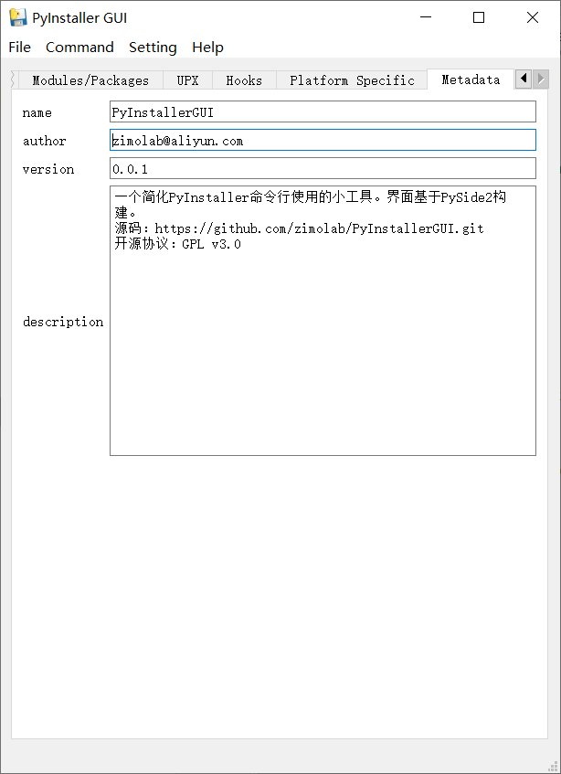


在界面上调整完所有参数之后，就可以回到Common选项页，点击底部**Pack按钮**，
或者通过Command菜单项下的**Start Pack**打开开始打包界面：


在Command文本框内，自动生成了当前界面配置所对应的命令行，在此，你可以手动对命令行进行调整，
然后直接点击Start按钮进行打包，或者将此命令行文本复制到你所工作的终端中。

### 使用PyInstallerGUI来打包自身

使用以下配置打包的结果：
```json
{
    "name": "PyInstallerGUI",
    "author": "zimolab@aliyun.com",
    "version": "0.0.1",
    "description": "一个简化PyInstaller命令行使用的小工具。界面基于PySide2构建。\n源码：https://github.com/zimolab/PyInstallerGUI.git\n开源协议：GPL v3.0",
    "pyinstaller": "pyinstaller",
    "pyimakespec": "pyi-makespec",
    "scripts": [
        "main.py"
    ],
    "options": {
        "addData": [
            "../data;data"
        ],
        "clean": true,
        "distPath": "./build/dist",
        "icon": "../data/logos/pyinstaller-gui.ico",
        "noConfirm": true,
        "productMode": "onedir",
        "productName": "PyInstallerGUI",
        "specPath": "./build",
        "windowMode": "windowed",
        "workPath": "./build",
        "upx": {},
        "hooks": {},
        "windows": {},
        "macOSX": {}
    }
}
```

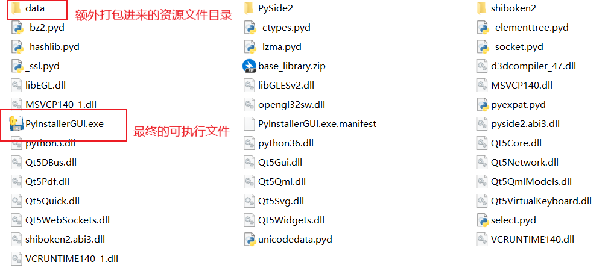


---

### 依赖

本项目依赖：

- Python3.6.8以上（更低版本未进行测试，不清楚是否可用）
- pyinstaller（如果需要打包项目”自身“的话，需要用的pyinstaller）
- PySide2
- QBinder

### 中文支持

本项目本来就是忙里偷闲的产物，谈不上什么精心设计，一切以快速达到目的为原则， 因此为了减少字符集问题可能带来的问题、混乱与拖延，
开始开发的时候就决定界面上的字符串全部使用英文。不过中文支持是必须的，因此这些字符串全部用tr()进行包裹，为之后的中文支持预留了空间，
后期将采用Qt的国际化工具完成中文化的工作。

### 开源协议

本项目采用GPL V3开源协议。

### 最后

如果，你觉得这个项目对你有所帮助的话，不妨点个赞。